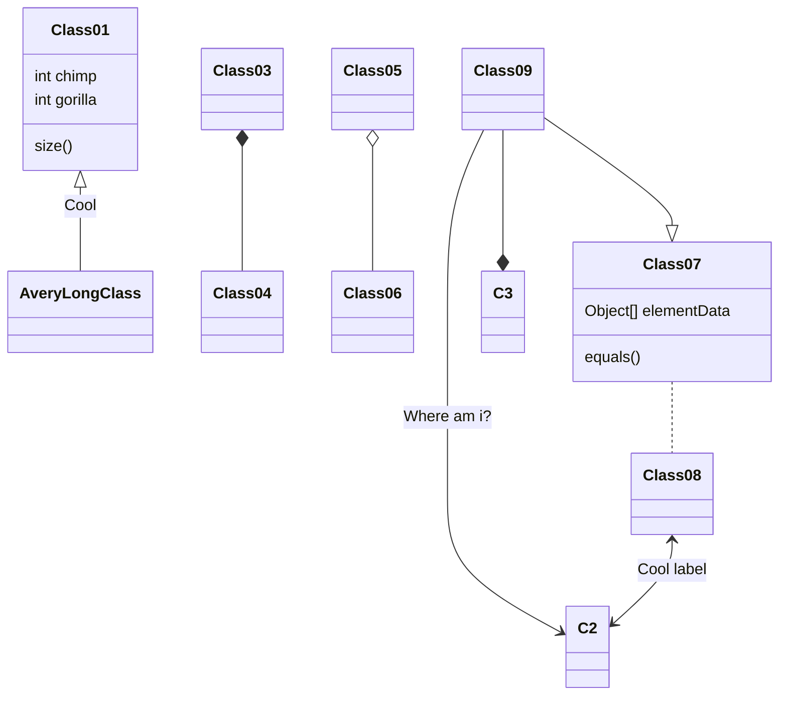
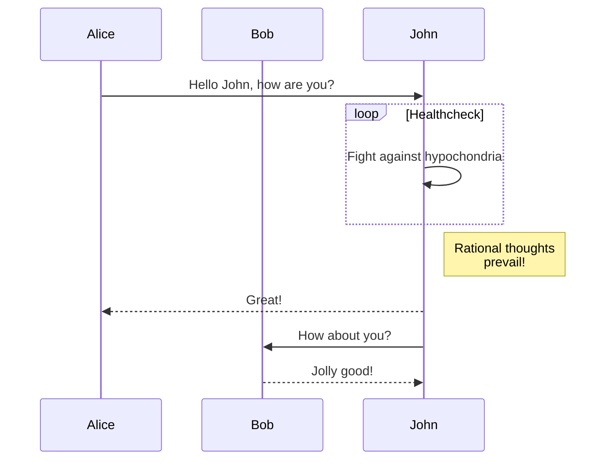
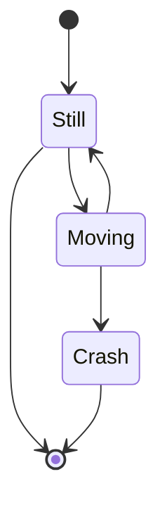

# README #

This is a haskell based RFXCom to MQTT bridge. It converts to and from the RFXCom Messages to JSON structures and publishes or subscribes on them from the MQTT broker.

**Work still in progress!**


### What is this repository for? ###

* This contains the source code for the RFXCom to MQTT Bridge and also known issues and plans for current and future releases of the application.

### How do I get set up? ###

* Clone the current repository to your computer.
* Get the stack tool.
* Set up the stack environment by issuing **stack setup** in the RFXCom directory.
* Run **stack build**
* Execute it with **stack exec rfxcom**

### Contribution guidelines ###

_Toolchain:_

* I use emacs and I have installed **intero** and **magit**
* I have setup so emacs can use **cabal, hasktags, hlint** and **stylish-haskell** in the search path. For instance in **~/.local/bin.**

_What to think consider:_

* Before checking in run **stylish-haskell** ( from emacs **M-x haskdell-mode-stylish-buffer**)

### Who do I talk to? ###

* Repo owner or admin, tomas.stenlund@telia.com.

# Klassdiagram



# Sekvensdiagram



# Flödesdiagram


# Statediagram



```mermaid
erDiagram
          CUSTOMER }|..|{ DELIVERY-ADDRESS : has
          CUSTOMER ||--o{ ORDER : places
          CUSTOMER ||-->{ INVOICE : "liable for"
          DELIVERY-ADDRESS ||--o{ ORDER : receives
          INVOICE ||--|{ ORDER : covers
          ORDER ||--|{ ORDER-ITEM : includes
          PRODUCT-CATEGORY ||--|{ PRODUCT : contains
          PRODUCT ||--o{ ORDER-ITEM : "ordered in"
  ```
